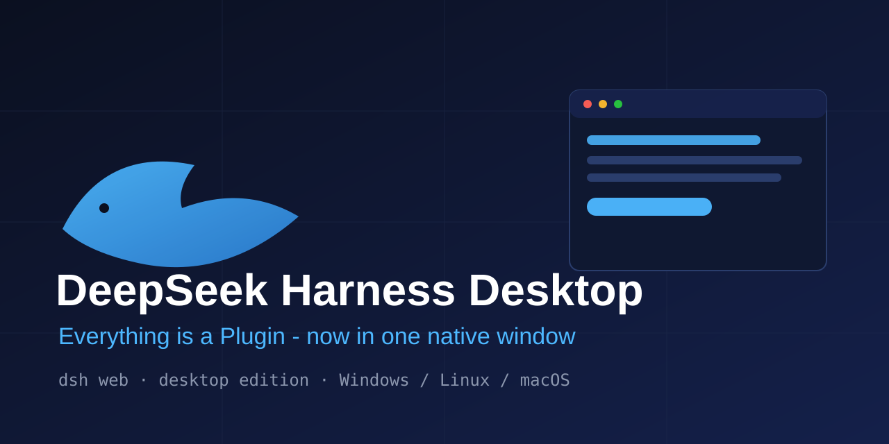

<div align='center'>



# DeepSeek Harness Desktop（DeepSeek Harness 桌面版）

**Everything is a Plugin —— 现在装进一个原生窗口。**

[DeepSeek Harness](https://github.com/deepseek-ai/deepseek-harness)（dsh）的非官方桌面应用：DeepSeek 开源的插件化 AI Agent 运行时，双击即用，无需命令行。

[](https://github.com/WeiLiu03/deepseek-harness-desktop)
[](https://github.com/WeiLiu03/deepseek-harness-desktop/releases)
[](./LICENSE)

[下载](https://github.com/WeiLiu03/deepseek-harness-desktop/releases) · [English](./README.md) · [问题反馈](https://github.com/WeiLiu03/deepseek-harness-desktop/issues) · [上游项目：deepseek-ai/deepseek-harness](https://github.com/deepseek-ai/deepseek-harness)

</div>

---

## 什么是 DeepSeek Harness 桌面版？

**DeepSeek Harness** 是 DeepSeek 开源的 AI Agent 运行时，核心理念是 *Agent = Model + Harness*、*Everything is a Plugin（一切皆插件）*。它以命令行工具 dsh 发布，dsh web 会在本地（默认 3080 端口）启动一个 Web 界面。

**DeepSeek Harness Desktop** 把这个运行时打包成原生桌面应用，双击即可运行 DeepSeek 的 Agent 运行时：

- 内置 @deepseek-ai/dsh（0.1.0-rc.6）—— 无需 npm install，无需终端
- 自动启动本地 dsh 服务，启动过程有实时状态页
- 若同端口已有 dsh web 在运行，则直接复用（方便开发者调试）
- 系统托盘：显示窗口 / 重启 dsh 服务 / 刷新 / 退出
- 提供 Windows 安装版与便携版；含 Linux、macOS 构建配置
- 输出详细服务日志（dsh-server.log），排查问题更方便

## 下载

前往 [Releases](https://github.com/WeiLiu03/deepseek-harness-desktop/releases) 下载最新安装包：

| 文件 | 平台 | 说明 |
| --- | --- | --- |
| DeepSeek-Harness-Desktop-Setup-x.x.x.exe | Windows 10/11 (x64) | NSIS 安装版 |
| DeepSeek-Harness-Desktop-x.x.x.exe | Windows 10/11 (x64) | 便携版，免安装 |

> **注意**：社区构建未签名，Windows SmartScreen 可能提示（点「更多信息 > 仍要运行」）。dsh 需要 PATH 中有 Node.js >= 22.6。

## 快速开始

### 方式一：下载安装包（推荐）

1. 从 [Releases](https://github.com/WeiLiu03/deepseek-harness-desktop/releases) 下载安装包；
2. 安装（或直接运行便携版）；
3. 启动后应用会自动拉起 dsh web 并打开 http://127.0.0.1:3080。

### 方式二：源码运行

```bash
git clone https://github.com/WeiLiu03/deepseek-harness-desktop
cd deepseek-harness-desktop
npm install
npm start
```

### 方式三：自行打包

```bash
npm run dist:win   # Windows 安装包，产物在 dist/ 目录
```

打包时 afterPack 钩子（scripts/after-pack.js）会自动补全 dsh 的隐式依赖，保证打包产物开箱即用。

## 配置

| 环境变量 | 默认值 | 说明 |
| --- | --- | --- |
| `DSH_PORT` | `3080` | dsh Web 服务端口 |

> **注意**：建议 PATH 中有较新的 node（>= 22.6）；应用优先使用系统 Node.js，找不到时回退到 Electron 内置运行时。

## 运行原理

1. 启动时探测端口（默认 3080）；
2. 若已有你自己的 dsh web 在监听，直接加载；
3. 否则拉起内置的 dsh web（优先系统 Node.js），轮询就绪后加载界面；
4. 退出应用时自动关闭由它拉起的服务进程。

## 常见问题

**这是 DeepSeek 官方产品吗？**
不是。这是非官方社区项目。DeepSeek Harness 本体由 DeepSeek-AI 开发：[deepseek-ai/deepseek-harness](https://github.com/deepseek-ai/deepseek-harness)。

**使用哪个端口？**
默认 3080，可用 `DSH_PORT` 环境变量覆盖。

**服务日志在哪里？**
Windows：%APPDATA%/DeepSeek Harness Desktop/dsh-server.log。

**能用我自己安装的 dsh 吗？**
可以。自己先跑 dsh web，应用检测到端口已占用会直接连接，不会重复启动。

## 路线图

- [ ] 首次运行引导（模型 API Key 配置）
- [ ] 自动更新
- [ ] Profile 支持（dsh --profile）
- [ ] 内置服务日志查看器

## 相关项目

- [deepseek-ai/deepseek-harness](https://github.com/deepseek-ai/deepseek-harness) —— 上游 Agent 运行时
- [@deepseek-ai/dsh](https://www.npmjs.com/package/@deepseek-ai/dsh) —— 官方 npm 包

## 参与贡献

欢迎提交 Issue 和 PR！开发需要 Node.js 20+：npm install 后执行 npm start 即可调试 Electron 壳。

## 多多支持 · Star

如果 DeepSeek Harness 桌面版帮你省下了一个终端窗口，**请点一个 Star 支持一下**！你的 Star 能让更多搜索 deepseek harness 的开发者发现这个项目，也是我们持续维护的最大动力。欢迎 Star、Fork、分享传播！

## Star History

[](https://star-history.com/#WeiLiu03/deepseek-harness-desktop&Date)

## 免责声明

本项目为非官方社区项目。DeepSeek Harness 由 DeepSeek-AI 开发并以 MIT 协议开源。

## 许可证

MIT (c) DeepSeek Harness Desktop contributors
